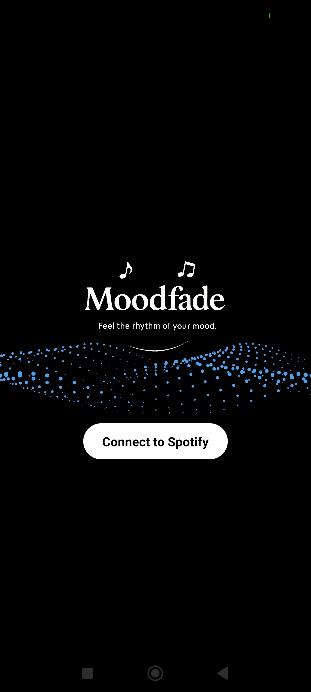
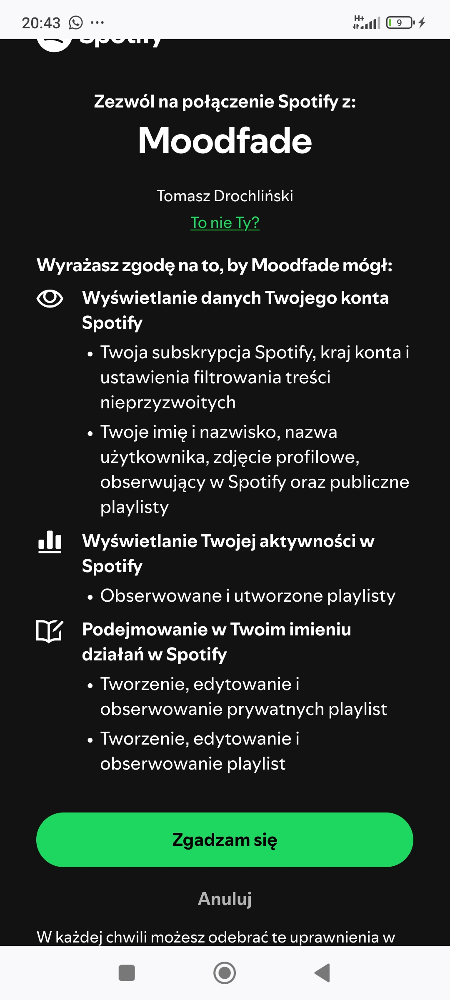
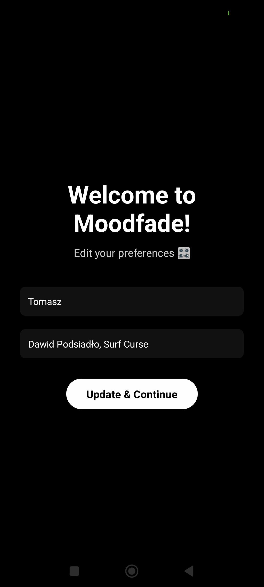
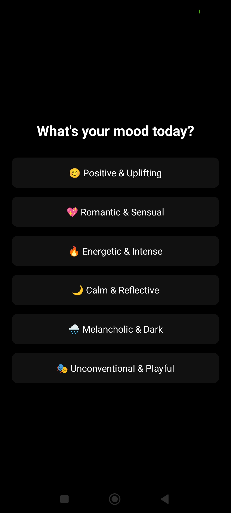
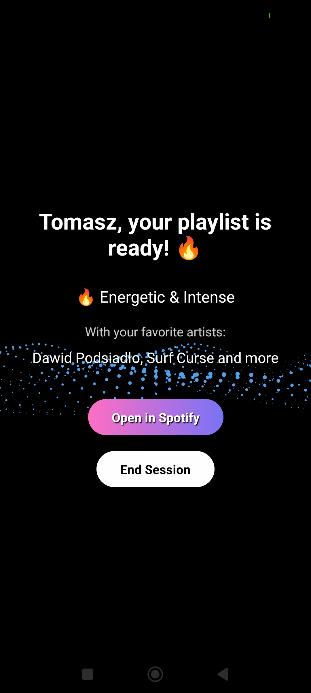
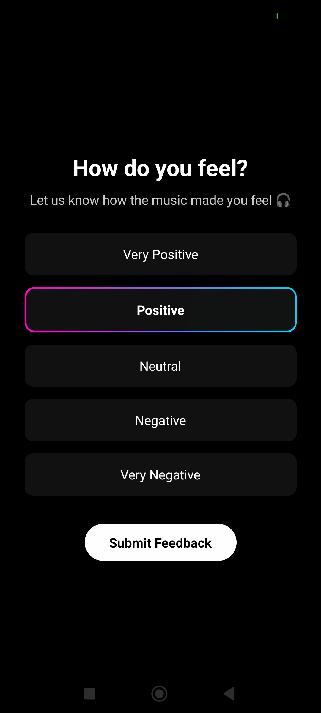

# 🎵 Moodfade

**Feel the rhythm of your mood.**  
Moodfade is a mobile app built with **React Native (Expo)** that helps you generate mood-based Spotify playlists using your preferences and real-time mood selection. It's a minimalist, AI-assisted music companion that makes music work for your mind.

---

## ✨ Features

- 🔐 **Spotify Authentication** (OAuth)
- 🎧 Generate playlists based on today's mood
- ❤️ Add your favorite artists
- 🔀 Mix tracks from Firebase and Spotify
- 🎶 Automatically create and update the *Moodfade* playlist in your Spotify account
- 🧠 Feedback system to reflect how the music made you feel

---

## 🖼️ App Screenshots

| Splash & Login | Spotify Auth | Preferences |
|----------------|--------------|-------------|
|  |  |  |

| Mood Selection | Loading | Playlist Ready |
|----------------|---------|----------------|
|  |  |  |

| Feedback |
|----------|
|  |

> Make sure to place these images inside a `screenshots/` folder in your project root.

---

## ⚙️ Installation

1. Clone the repository:

```bash
git clone https://github.com/tadrochlinski/Moodfade.git
cd Moodfade
```

2. Install dependencies:

```bash
npm install
```

3. Run the app:

```bash
npx expo start
```

Scan the QR code using the **Expo Go** app on your phone.

---

## 💡 How It Works

1. You log in with your Spotify account.
2. You enter your name and favorite artists.
3. You pick a mood for today.
4. The app pulls:
   - 30 random tracks from Firebase based on the selected mood
   - 15 tracks from your favorite artists (via Spotify)
5. The app creates or updates a *Moodfade* playlist in your Spotify account.
6. You listen to the playlist directly in the Spotify app.
7. After the session, you rate your mood.

---

## 🛠️ Built With

- [Expo + React Native](https://expo.dev/)
- [Firebase Firestore](https://firebase.google.com/)
- [Spotify Web API](https://developer.spotify.com/)
- [AsyncStorage & SecureStore](https://docs.expo.dev/)
- [React Navigation](https://reactnavigation.org/)

---

## 📄 License

This project is in development and intended for educational and prototyping purposes. Not affiliated with Spotify.

---

## 👨‍💻 Author

**Tadeusz Rochliński**  
GitHub: [@tadrochlinski](https://github.com/tadrochlinski)

---

> Found it helpful? Leave a ⭐ on the repo!
